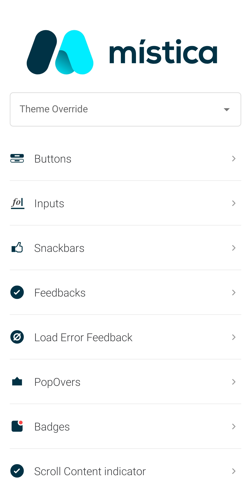

<br>
<br>

<br>

#  Mistica for Android

[](https://github.com/Telefonica/mistica-android)
[](https://github.com/Telefonica/mistica-android)
[](https://github.com/Telefonica/mistica-android)
[](https://kotlinlang.org/docs/reference/whatsnew13.html)

Mistica is a framework that contains reusable UI components and utilities.

## Instalation

Inside the dependency block in your build.gradle, add this line to add the library:

```gradle
dependencies {
    ...
    implementation 'com.telefonica.mistica:mistica:$version'
    ...
}
```

In case you also want to include also the components catalog in your application:

```gradle
dependencies {
    ...
    implementation 'com.telefonica.mistica:mistica:$version'
    implementation 'com.telefonica.mistica:mistica-catalog:$version'
    ...
}
```

## Configuration

Mistica provides an Android theme for each brand supported by telefonica.
Just set your App or any specific activity to use any of the following:

* MisticaTheme.Movistar
* MisticaTheme.Movistar.Prominent
* MisticaTheme.O2
* MisticaTheme.O2Classic
* MisticaTheme.Vivo

```xml
<manifest ...>
    <application
        ...
        android:theme="@style/MisticaTheme.Movistar" />
</manifest>
```

```xml
...
<activity
    ...
    android:theme="@style/MisticaTheme.Movistar.Prominent" />
...
```

## Components

* [Buttons](library/src/main/java/com/telefonica/mistica/button)
* [Inputs](library/src/main/java/com/telefonica/mistica/input)
* [Snackbars](library/src/main/java/com/telefonica/mistica/feedback)
* [Screen Feedbacks](library/src/main/java/com/telefonica/mistica/feedback/screen)
* [Load Error Feedback](library/src/main/java/com/telefonica/mistica/feedback/error)
* [Pop Overs](library/src/main/java/com/telefonica/mistica/feedback/popover)
* [Badges](library/src/main/java/com/telefonica/mistica/badge)
* [Scroll Content Indicator](library/src/main/java/com/telefonica/mistica/contentindicator)
* [Tags](library/src/main/java/com/telefonica/mistica/tag)
* [Lists](library/src/main/java/com/telefonica/mistica/list)
* [Headers](library/src/main/java/com/telefonica/mistica/header)
* [Sections](library/src/main/java/com/telefonica/mistica/section)
* [Chips](library/src/main/java/com/telefonica/mistica/chips)
* [Highlighted Cards](library/src/main/java/com/telefonica/mistica/highlightedcard)

## Text Presets Styles

Library includes a set of available [Text Appearance](library/src/main/res/values/styles_fonts.xml) styles, applicable for all kind of TextViews.

## Demo app

Included in this repository is a demo of currently implemented components. A full list of implemented components can be found here: [Components](library/src/main/java/com/telefonica/mistica).

The app can be downloaded [here](https://install.appcenter.ms/orgs/tuenti-organization/apps/mistica/distribution_groups/public) or manually built.

To compile the app manually run the [App](app) module in Android Studio.

<p align="left">
    
</p>

## Contributing

See [CONTRIBUTING.md](./CONTRIBUTING.md)
 
