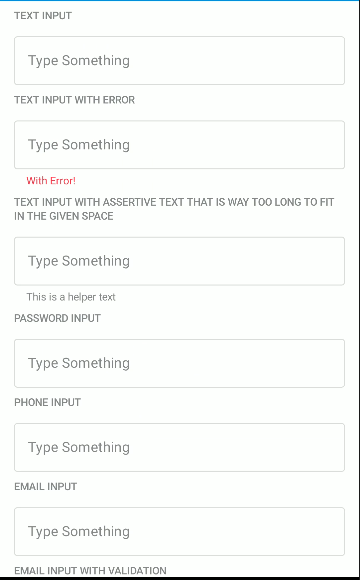

# Form Inputs

   
   

Current Composable input types:
* `TextInput`
* `PhoneInput`
* `EmailInput`

**Note**: not every input component is migrated yet to compose. Those components that need to be migrated at some point are:
* Text area (from `com.telefonica.mistica.input.TextInput` with `inputType="textArea"`)
* Password input text (from `com.telefonica.mistica.input.TextInput` with `inputType="password"`)
* Check Box Input (from `com.telefonica.mistica.input.CheckBoxInput`)
* Drop Down Input (from `com.telefonica.mistica.input.DropDownInput`)