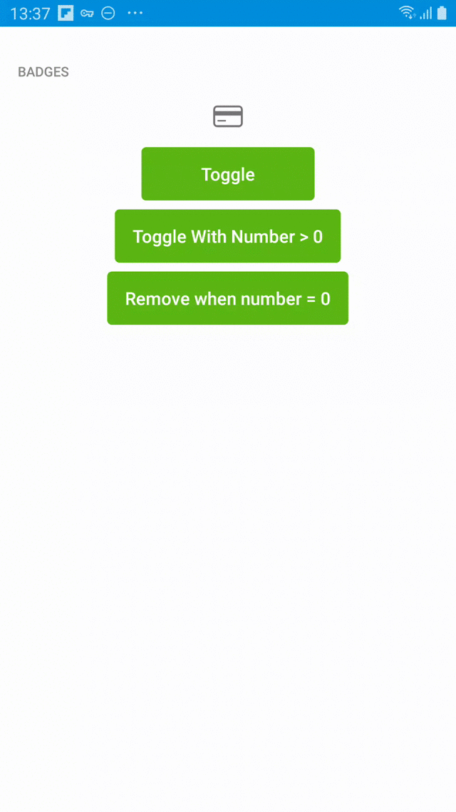

Badges are placed on an overlay, at the top right side of any other view:

<p align="center">
    
</p>

To use it, use `com.tuenti.ui.core.component.badge.Badge`

There are two group of methods:

```kotlin
fun showBadgeIn(anchor: View, count: Int = 0)
fun showBadgeIn(anchor: View, parent: ViewGroup, count: Int = 0)
```
That will add a badge on the top right side of `anchor` view. The badge will be presented without a number, unless count is specified (and it has a positive number). All numbers bigger than 9 will be cropped to `9+`

Also, you can specify a `parent`, which will be the layout where `anchor` is presented. This is useful only when you need to do something custom, like positioning the badge closer to the view. (See `showProfileBadge` as an example)

`showBadgeIn` will return a BadgeDrawable, that should be kept referenced in order to remove it from the view.

```kotlin
fun removeBadge(badgeDrawable: BadgeDrawable, anchor: View)
fun removeBadge(badgeDrawable: BadgeDrawable, parent: ViewGroup)
```
Use these methods to delete the badge from the anchor/parent. You will need to decide which one to call based on how you added it to your anchor.
