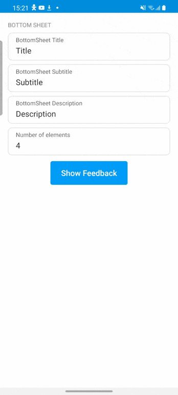

# Bottom Sheet

Bottom sheets are surfaces containing supplementary content that are anchored to the bottom of the screen.

<p align="center">
    
</p>

To use it, use `com.telefonica.mistica.bottomsheet.BottomSheet`

```kotlin
BottomSheet(context)
    .withHeader(
        title = "Title",
        subtitle = "Subtitle",
        description = "Description",
    )
    .withList(
        id = "list-0",
        elements = listOf()
    )
    .withOnBottomSheetClickedListener(object: OnBottomSheetClicked {
        override fun onTapped(bottomSheet: BottomSheetView,  childrenId: String, itemId: String) {
            Toast
                .makeText(this@BottomSheetCatalogFragment.context, "Onclicked: [Children: $childrenId, item:$itemId]", Toast.LENGTH_SHORT)
                .show()
            MainScope().launch {
                delay(500)
                bottomSheet.dismiss()
            }
        }
    })
    .show()

```