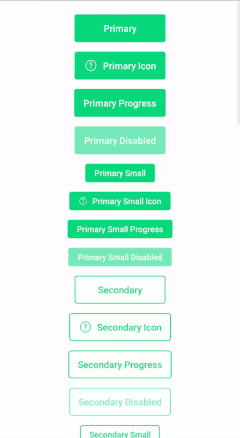
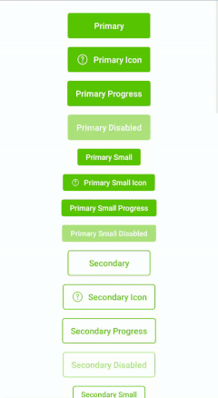
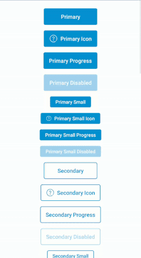
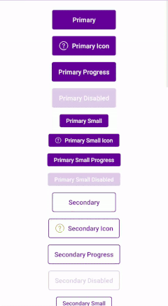

Following classes should be used to place buttons in the app:
* `com.telefonica.mistica.Button` --> Simple button with primary style applied by default
* `com.telefonica.mistica.ProgressButton` --> In case of the need of a loading state (a button with progress), this one can be used to show an spinner (with an optional loading text) with an animation. `app:isLoading` attribute can be used in order to set it as loading on xml layouts for databinding.

In order to change appearance of them, just set the required style (styles for all kind of buttons are available on [styles_buttons.xml](https://github.com/tef-novum/android-messenger/blob/integration/toolkit/palette/src/main/res/values/styles_buttons.xml)).

    
    

    
    

