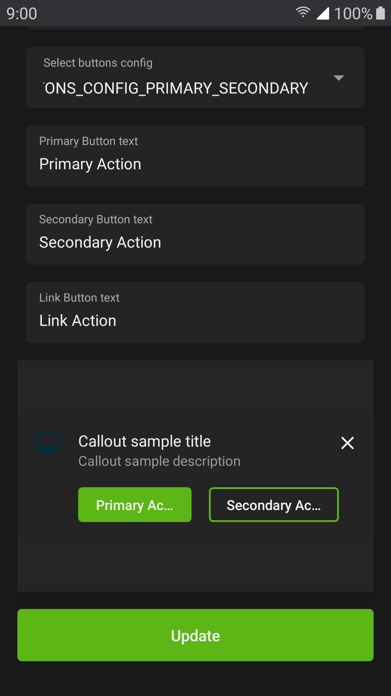
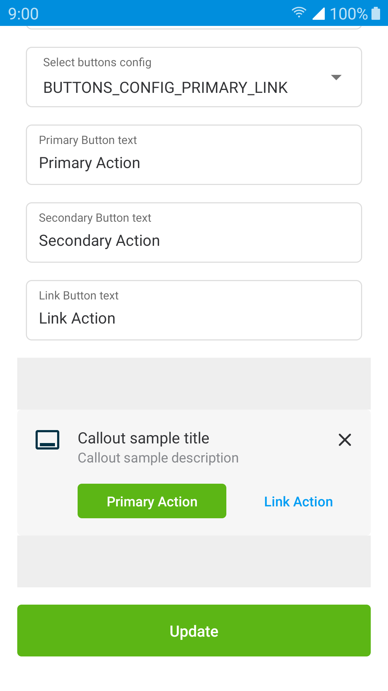
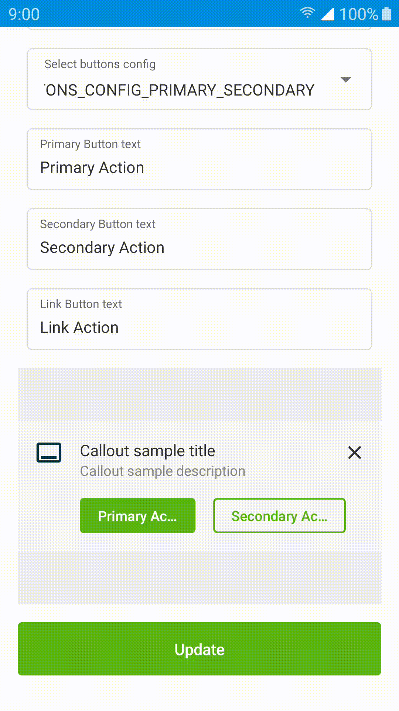

# Callout

<p align="center">
   
   
   
</p>

Implemented as a custom view, `com.telefonica.mistica.callout.CalloutView` can be used inside any layout like a regular view. It supports both **attribute
configuration and databinding for all properties**.

```xml
<declare-styleable name="CalloutView">
	<attr name="calloutTitle" format="string"/>
	<attr name="calloutDescription" format="string"/>
	<attr name="calloutIcon" format="reference"/>
	<attr name="calloutButtonsConfig" format="enum">
		<enum name="none" value="-1"/>
		<enum name="primary" value="0" />
		<enum name="primary_link" value="1" />
		<enum name="primary_secondary" value="2" />
		<enum name="secondary" value="3" />
		<enum name="secondary_link" value="4" />
		<enum name="link" value="5" />
	</attr>
	<attr name="calloutPrimaryButtonText" format="string" />
	<attr name="calloutPrimaryButtonOnClick" format="string" />
	<attr name="calloutSecondaryButtonText" format="string" />
	<attr name="calloutSecondaryButtonOnClick" format="string" />
	<attr name="calloutLinkButtonText" format="string" />
	<attr name="calloutLinkButtonOnClick" format="string" />
	<attr name="calloutDismissable" format="boolean"/>
	<attr name="calloutInverse" format="boolean"/>
</declare-styleable>
```
