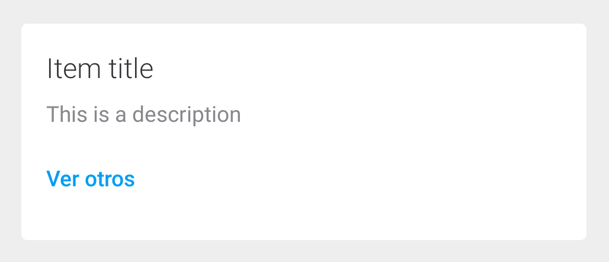
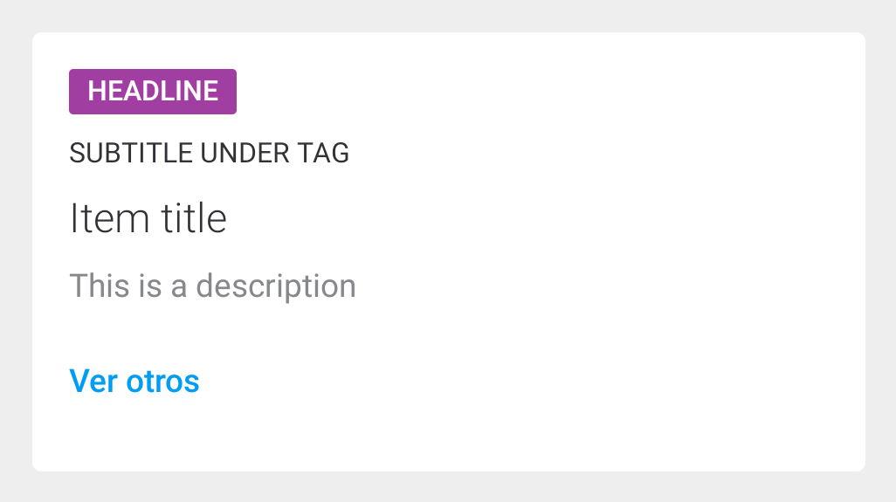
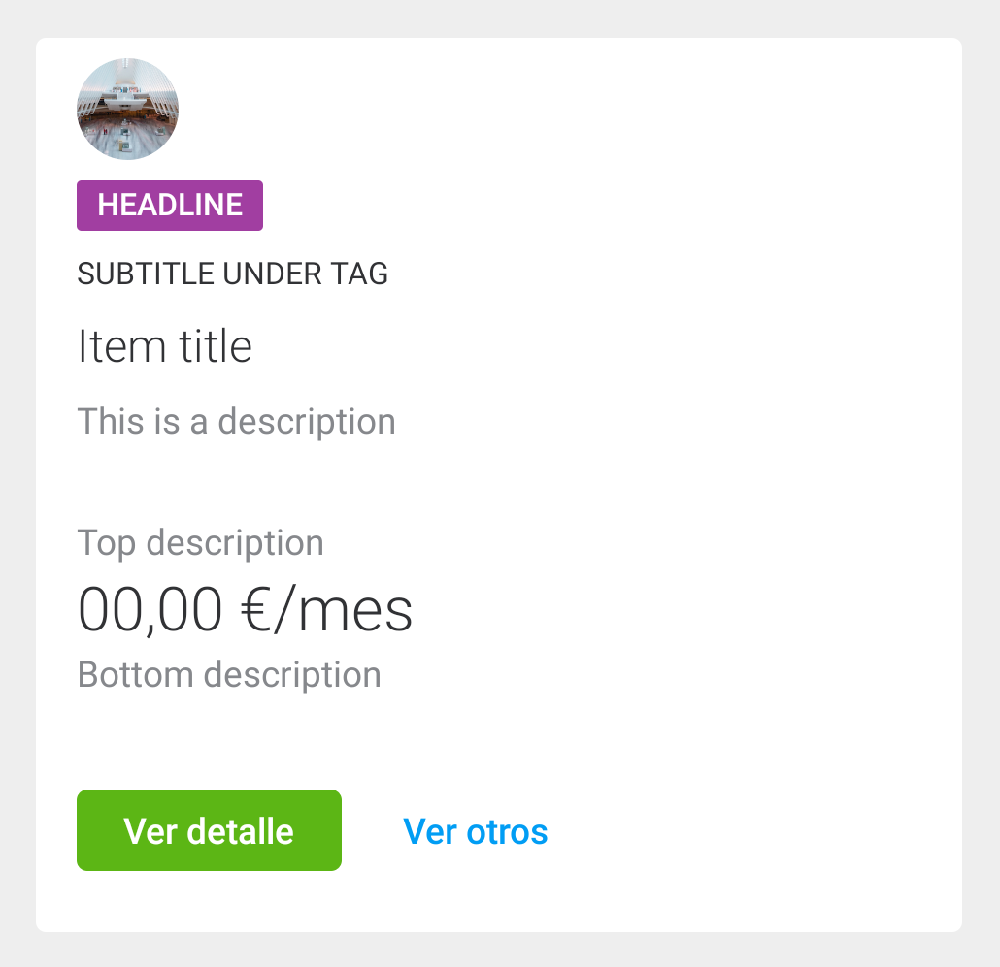

# Data Cards

<p align="center">
    
    
    
</p>

Data cards require a minimum content of a **title, description and a link button.**
Implemented as a custom view, `com.telefonica.mistica.card.datacard.DataCardView` can be used inside any layout like a regular view. It supports both **attribute configuration and databinding for all properties**.

```xml
    <declare-styleable name="CardView">
        <attr name="cardIcon" format="reference" />
        <attr name="cardIconType" format="enum">
            <enum name="icon" value="0" />
            <enum name="circularIcon" value="1" />
        </attr>
        <attr name="cardTag" format="string" />
        <attr name="cardTitle" format="string" />
        <attr name="cardSubtitle" format="string" />
        <attr name="cardDescription" format="string" />
        <attr name="cardPrimaryButtonText" format="string" />
        <attr name="cardLinkButtonText" format="string" />
        <attr name="cardPrimaryButtonOnClick" format="string" />
        <attr name="cardLinkButtonOnClick" format="string" />
    </declare-styleable>
```
