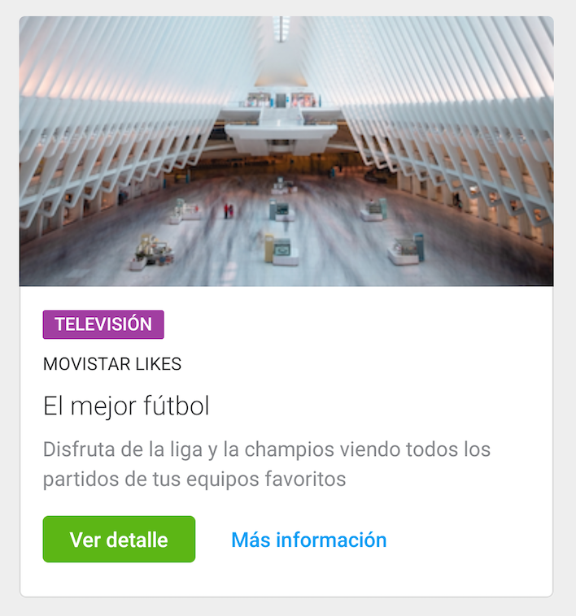

# Media Cards

Media cards consist of an image and some data:

<p align="center">
    
    
    
</p>

To use it, use `com.telefonica.mistica.card.mediacard.MediaCardView`

Minimum required content for media cards is an image/gif/video with a description or a title. The rest of the elements are optional and can be easily 
configured through the public api or via xml `attr`: 

```xml
    <declare-styleable name="CardView">
        <attr name="cardImage" format="reference" />
        <attr name="cardTag" format="string" />
        <attr name="cardPretitle" format="string" />
        <attr name="cardTitle" format="string" />
        <attr name="cardDescription" format="string" />
        <attr name="cardPrimaryButtonText" format="string" />
        <attr name="cardLinkButtonText" format="string" />
        <attr name="cardPrimaryButtonOnClick" format="string" />
        <attr name="cardLinkButtonOnClick" format="string" />
    </declare-styleable>
```

Media cards will also enable adding different types of media other than images, such as video or gifs. 
It provides the following method were any kind of view can be passed and will be displayed at the top
of the card matching the whole card width and wrapping the height of the media content. 

```kotlin
fun setOtherMultimedia(view: View)
```

A `VideoView` or any other kind of custom view can be added. 
