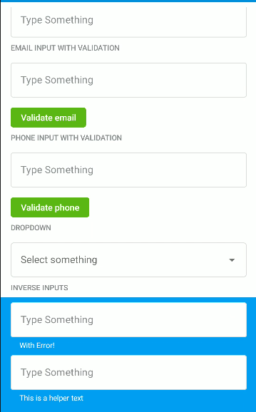

# Form Inputs

   
   

Current Composable input types:
* `TextInput`
* `PhoneInput`
* `EmailInput`
* `PasswordInput`
* `TextAreaInput`
* `CheckBoxInput`
* `DropDownInput` (Implemented with `AndroidView`)
