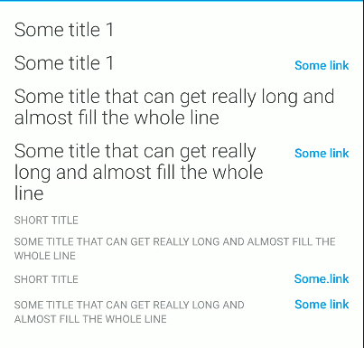

## Titles

<p align="left">
   
</p>
<p align="left">
   
</p>

Jetpack Compose version of "Title" component. Example of usage:

```
Title(
    modifier = Modifier.fillMaxWidth(),
    text = "Some title",
    style = TitleStyle.TITLE_1,
    linkText = "Some link", // Nullable
    onLinkClicked = {} // Nullable
    withChevron = true // Nullable
)
```
