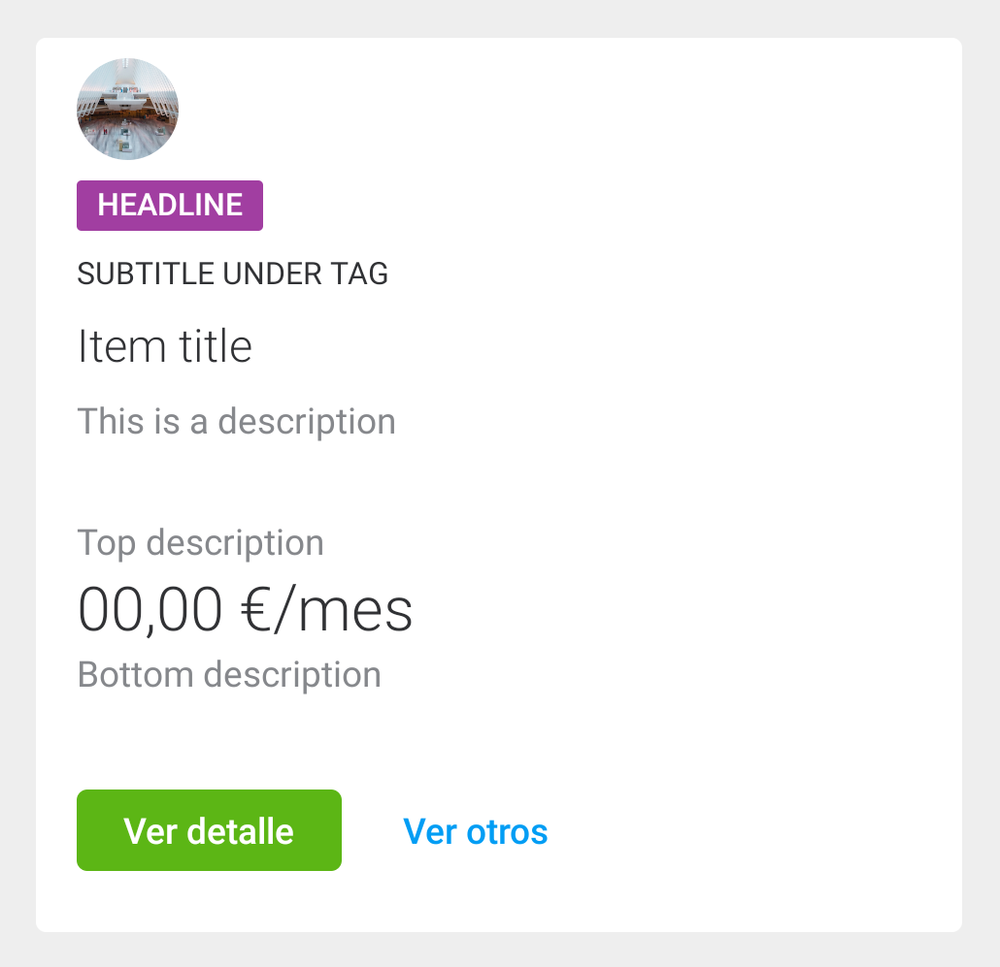

# Data Cards

<p align="center">
    
    
    
</p>

Data cards require a minimum content of a **title, description and a link button.**
Implemented as a custom view, `com.telefonica.mistica.datacard.DataCardView` can be used inside any layout like a regular view. It supports both **attribute configuration and databinding for all properties**.

```xml
    <declare-styleable name="DataCardView">
        <attr name="dataCardIcon" format="reference" />
        <attr name="dataCardTag" format="string" />
        <attr name="dataCardTitle" format="string" />
        <attr name="dataCardSubtitle" format="string" />
        <attr name="dataCardDescription" format="string" />
        <attr name="dataCardPrimaryButtonText" format="string" />
        <attr name="dataCardLinkButtonText" format="string" />
        <attr name="dataCardPrimaryButtonOnClick" format="string" />
        <attr name="dataCardLinkButtonOnClick" format="string" />
    </declare-styleable>
```