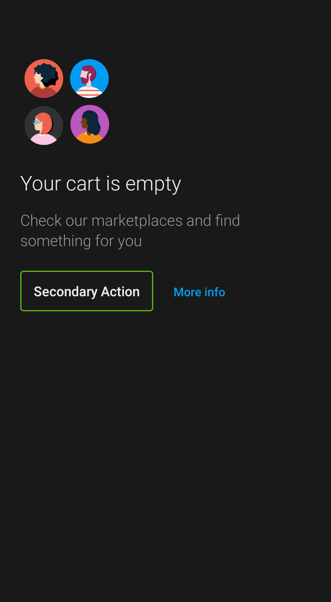

# Empty States

<p align="left">
    
    
</p>

Empty States require a minimum content of **an image and a
title**

Implemented as a custom view,
`com.telefonica.mistica.emptystate.screen.EmptyStateScreenView` can be
used inside any layout like a regular view.

It supports **attribute-based configuration for all properties**.

```xml
<declare-styleable name="EmptyStateScreenView">
    <attr name="emptyStateScreenImage" format="reference" />
    <attr name="emptyStateScreenImageContentDescription" format="string" />
    <attr name="emptyStateScreenImageSize" format="enum">
        <enum name="icon" value="0" />
        <enum name="small" value="1" />
        <enum name="full_width" value="2" />
    </attr>
    <attr name="emptyStateScreenTitle" format="string" />
    <attr name="emptyStateScreenSubtitle" format="string" />
    <attr name="emptyStateScreenButtonsConfig" format="enum">
        <enum name="none" value="0" />
        <enum name="primary" value="1" />
        <enum name="primary_link" value="2" />
        <enum name="primary_secondary" value="3" />
        <enum name="secondary" value="4" />
        <enum name="secondary_link" value="5" />
    </attr>
    <attr name="emptyStateScreenPrimaryButtonText" format="string" />
	<attr name="emptyStateScreenPrimaryButtonLoadingText" format="string" />
    <attr name="emptyStateScreenPrimaryButtonOnClick" format="string" />
    <attr name="emptyStateScreenSecondaryButtonText" format="string" />
    <attr name="emptyStateScreenSecondaryButtonOnClick" format="string" />
    <attr name="emptyStateScreenLinkButtonText" format="string" />
    <attr name="emptyStateScreenLinkButtonOnClick" format="string" />
</declare-styleable>
```
