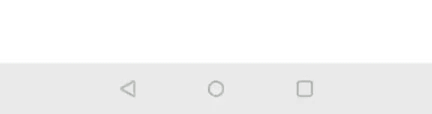
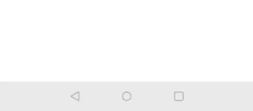

# Snackbars

Snackbars allow to show contextual information usually after the user has done any action. Snackbars are displayed during 5 seconds on the screen if there isn't an action associated, and 10 when is it. There are also two types, informative and critical:

    
    

`SnackbarBuilder` **allows showing snackbars** on any part of the app:
* `SnackbarBuilder(view: View, @StringRes resId: Int)`
  * Prepares an snackbar to show it over the specified view with given string resource as message
* `SnackbarBuilder(view: View, text: String): SnackbarBuilder`
  * Prepares an snackbar to show it over the specified view with given string as message. 

Builder allows SnackBar customization:
* `withAction(String text, OnClickListener listener)`
  * Adds an action with the given text and the given click listener
* `withAction(@StringRes int resId, OnClickListener listener)`
  * Adds an action with the given string resource and the given click listener
* `withCallback(Callback callback)`
  * Adds a callback for dismiss action. Dismiss action by definition will only work when using a coordinator layout as anchor view for the SnackBar.

Finally, depending on the type of SnackBar, use one of the following to display it:
* `showInformative()`
* `showCritical()`
