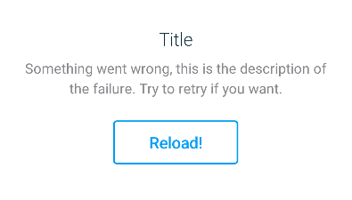

# Load Error Feedback

<p align="center">
   
</p>

Implemented as a custom view, `com.telefonica.mistica.feedback.error.LoadErrorFeedbackView` can be used inside any layout like a regular view. It supports **attribute-based configuration for all properties**.

```xml
<declare-styleable name="LoadErrorFeedback">
    <attr name="loadErrorFeedbackTitle" format="string"/>
    <attr name="loadErrorFeedbackDescription" format="string"/>
    <attr name="loadErrorFeedbackButtonText" format="string"/>
    <attr name="loadErrorFeedbackButtonOnClick" format="string"/>
    <attr name="loadErrorFeedbackIsLoading" format="boolean"/>
</declare-styleable>
```
