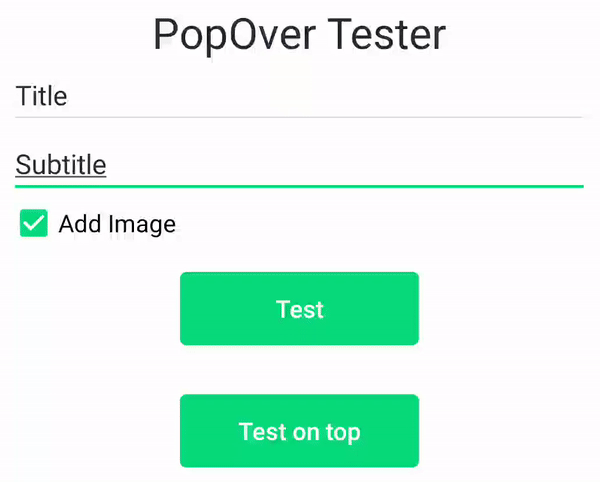
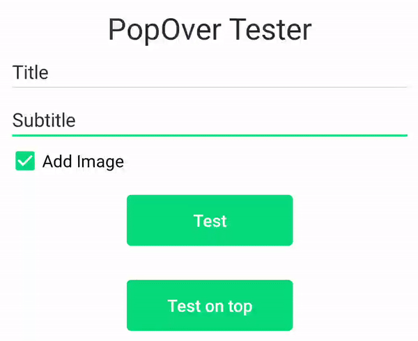

# PopOvers

A Popover can be used to display some content on top of another.

<p align="center">
    
</p>

`com.telefonica.mistica.feedback.popover.PopOver` **allows showing pop overs** on any part of the app:

```kotlin
PopOver(context: Context, targetView: View)
```
Which most relevant functions are:

```kotlin
setTitle(@StringRes stringId: Int): PopOver
setTitle(string: String): PopOver
setImage(@DrawableRes imageRes: Int): PopOver
setDescription(@StringRes stringId: Int): PopOver
setDescription(string: String): PopOver
setListener(listener: PopOverClickListener): PopOver
setPosition(position: PopOverView.Position = AUTO): PopOver

show(activity: Activity): PopOver
show(containerView: View): PopOver

hide(): Unit
```

If necessary, the position of the popover can be forced to the view it is linked to.
AUTO: The position is calculated in reference to the space that the popover has.
TOP: Force to appear on top of the view it is linked.
BOTTOM: Force to appear on bottom of the view it is linked.
```kotlin
enum class PopOverView.Position {
    AUTO, TOP, BOTTOM
}
```


A pop over can contain an image. It's size should be 40x40dp:
<p align="center">
    
</p>


A pop over anchored in a view will be shown above it, unless there is no space enough, then it will be shown below automatically:

<p align="center">
    
</p>
