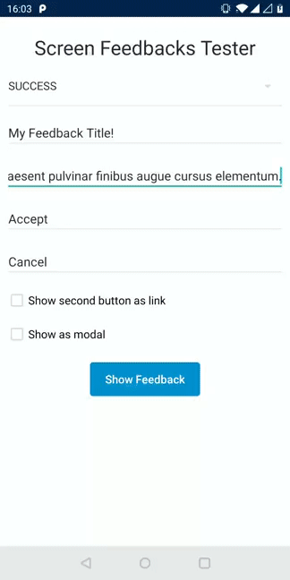

# Feedbacks

<p align="center">
    
</p>

`FeedbackScreenView` can be used inside any layout like a regular view, presentation of the view can be diferent depending on the design requirements. In order to configure it for the specific purpose, it supports both **attribute configuration** and **databinding for all properties**

```xml
<declare-styleable name="FeedbackScreen">
    <attr name="feedbackType" format="enum">
        <enum name="success" value="0"/>
        <enum name="error" value="1"/>
        <enum name="info" value="2"/>
    </attr>
    <attr name="feedbackTitle" format="string"/>
    <attr name="feedbackSubtitle" format="string"/>
    <attr name="feedbackCustomContentLayout" format="reference"/>
    <attr name="feedbackFirstButtonText" format="string"/>
    <attr name="feedbackSecondButtonText" format="string"/>
    <attr name="feedbackSecondButtonAsLink" format="boolean"/>

    <attr name="feedbackFirstButtonOnClick" format="string"/>
    <attr name="feedbackSecondButtonOnClick" format="string"/>
</declare-styleable>
```
