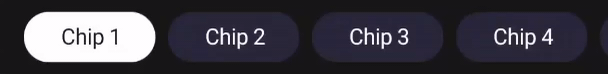

In addition to the standard behavior of a `ChipGroup` with `Chips`, our Filters component has the following features:
* Filters on a single horizontal line
* Horizontal scroll
* Single selection (like a radio group)
* One and only one filter must be always selected
* When selecting a Filter partially hidden the group automatically scrolls to fully show the filter.

<p align="center">
    
    
    
    
</p>

# HorizontalScrollFilterGroup
The implementation is done using a custom view [`HorizontalScrollFilterGroup`](./HorizontalScrollFilterGroup.kt) that encapsulates a `HorizontalScrollView` with a `ChipGroup` inside. This component already provides all the extra behavior described above.

## Usage
You just need to add a `HorizontalScrollFilterGroup` to your layout:
```xml
<com.telefonica.mistica.filters.HorizontalScrollFilterGroup
    android:layout_width="match_parent"
    android:layout_height="wrap_content"
    android:background="?colorBackgroundBrand"
/>
```

# Chips
Chips need to be inflated and added to the ChipGroup in Java/Kotlin code. You can always use data binding if you create a binding adapter.

We only support "Chip Choice" for now, since that's the style that covers our current use case. So you'll need to inflate always the same already existing layout [com.telefonica.mistica.R.layout.chip_choice](../../../../../res/layout/chip_choice.xml).

## Usage
```kotlin
val chip = LayoutInflater.from(context)
    .inflate(R.layout.chip_choice, root, false)
    .let { view -> view as Chip }
    .apply {
        text = name
        isChecked = checked
        setOnClickListener { ... }
    }
horizontalScrollFilterGroup.addFilter(chip)
```
