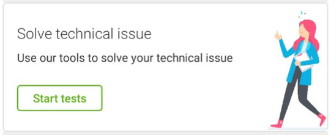

# Highlighted Cards

<p align="center">
   
   
   
   
   
</p>

Implemented as a custom view, `com.telefonica.mistica.highlightedcard.HighlightedCardView` can be used inside any layout like a regular view. It supports **attribute-based configuration for all properties**.

```xml
    <declare-styleable name="HighlightedCardView">
        <attr name="highlightedCardBackground" format="reference" />
        <attr name="highlightedCardInverse" format="boolean" />
        <attr name="highlightedCardTitle" format="string" />
        <attr name="highlightedCardContent" format="string" />
        <attr name="highlightedCardButton" format="string" />
        <attr name="highlightedCardImage" format="reference" />
        <attr name="highlightedCardCloseButtonVisibility" format="boolean" />
        <attr name="highlightedCardButtonOnClick" format="string" />
        <attr name="highlightedCardCloseButtonOnClick" format="string" />
        <attr name="highlightedCardButtonStyle" format="enum">
            <enum name="primary" value="0"/>
            <enum name="secondary" value="1"/>
            <enum name="link" value="2"/>
            <enum name="none" value="3"/>
        </attr>
        <attr name="highlightedCardImageStyle" format="enum">
            <enum name="modeFit" value="0"/>
            <enum name="modeFill" value="1"/>
            <enum name="none" value="2"/>
        </attr>
    </declare-styleable>
```
