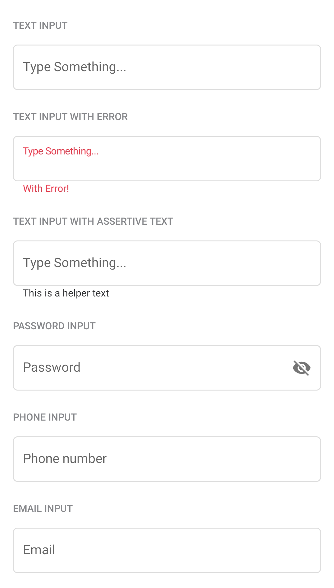
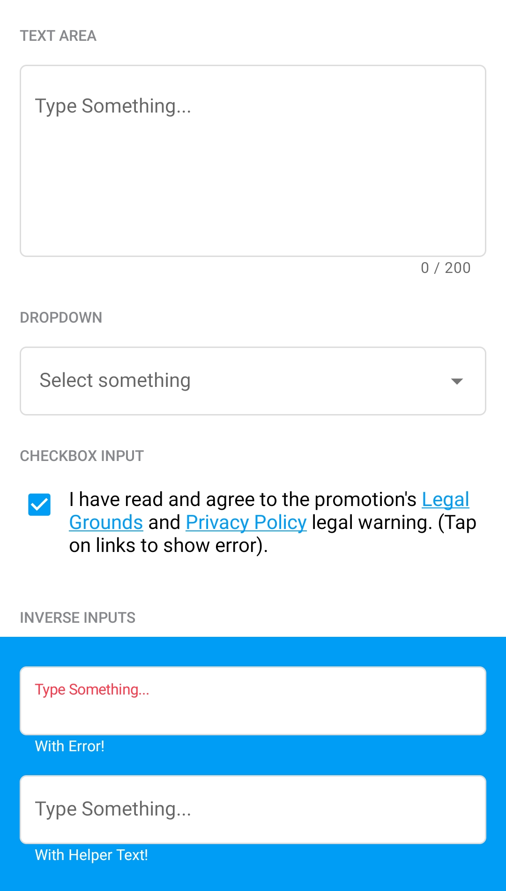

# Form Inputs

<p align="center">
   
   
</p>

There are three input types. For each one, a component is provided:
* Text Inputs --> `com.telefonica.mistica.input.TextInput`
* Check Box Input --> `com.telefonica.mistica.input.CheckBoxInput`
* Drop Down Input --> `com.telefonica.mistica.input.DropDownInput`

All them can be placed directly on any layout, and can be configured with the following attributes (**All attributes are supported for all types**):

```xml
<declare-styleable name="Input">
    <attr name="inputHint" format="string" />
    <attr name="inputError" format="string" />
    <attr name="inputHelperText" format="string" />
    <attr name="inputEnabled" format="boolean" />
    <attr name="inputInverse" format="boolean" />
</declare-styleable>
```

`com.telefonica.mistica.input.TextInput` supports additionally the following configuration:

```xml
<declare-styleable name="TextInput">
    <attr name="inputType" format="integer">
        <enum name="text" value="0" />
        <enum name="email" value="1" />
        <enum name="password" value="2" />
        <enum name="textArea" value="3" />
        <enum name="phone" value="4" />
    </attr>
    <attr name="inputText" format="string" /> 
    <attr name="inputCounterEnabled" format="boolean" />
    <attr name="inputMaxLength" format="integer" />
    <attr name="inputAutofillEnabled" format="boolean" />
</declare-styleable>
```

And `com.telefonica.mistica.input.CheckBoxInput` provides also:

```xml
<declare-styleable name="CheckBoxInput">
    <attr name="inputChecked" format="boolean" />
    <attr name="inputCheckText" format="string" />
</declare-styleable>
```

Following Material recommendations we implement Drop Down Input using a `TextInputLayout` with an
`AutoCompleteTextView` inside (No more `Spinner`). In order to better mimic the behavior of a drop
down selector we include an Adapter `com.telefonica.mistica.input.DropDownInput.Adapter` that
prevents filtering when (manually or programmatically) setting a text.

```kotlin
val dropDownInput: DropDownInput
dropDownInput.dropDown.setAdapter(
    DropDownInput.Adapter(
        context,
        R.layout.dropdown_menu_popup_item,
        listOf("First option", "Second option", "Third option")
    )
)
dropDownInput.dropDown.setOnItemClickListener { parent, view, position, id ->
    // do something
}
dropDownInput.dropDown.setText("First option") // Select first option
```

> [!NOTE]
> Form input components are implemented as standard Android Views and do not provide Android DataBinding or inverse DataBinding support.
> State changes can be handled through the exposed APIs and listeners.
