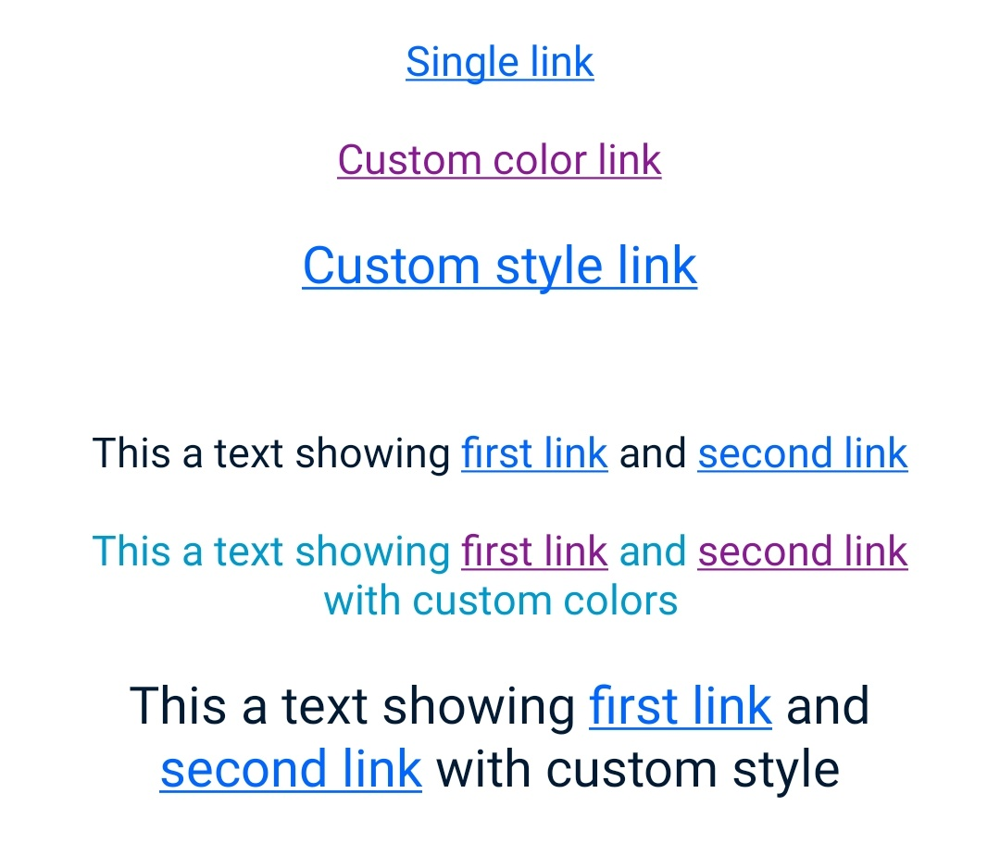

# TextLink Component

This Android component is a custom `TextView` designed to simplify the display of text containing clickable links. It leverages Android's `SpannableString` to
handle link creation and styling.

There are two main ways to use this component`:
1. **Using Single Link**: This is the most straightforward method, where you can provide a single link and its associated text.
2. **Using Multiple Links**: This method allows you to define multiple links within the same text, providing a more complex and flexible way to handle links.

You can find some examples of how to use the `TextLink` component in the [TextLinks catalog section](../../../../../../../../catalog/src/main/java/com/telefonica/mistica/catalog/ui/classic/components/TextLinkCatalogFragment.kt).
This class demonstrate how to create a simple link and a more complex link with multiple clickable segments.

**Main Benefit: Enhanced Accessibility**

The primary advantage of this component lies in its use of `SpannableString`. By applying this to the specific text ranges that represent links, the
component ensures that:

* **Screen Readers Recognize Links:** Accessibility services like TalkBack can identify these text segments as interactive links.
* **Proper Announcement:** When a user with visual impairments focuses on a link, the screen reader will announce it as a "link," providing crucial context and
  usability.
* **Standard Interaction:** Users can interact with these announced links using standard accessibility gestures, such as double-tapping to activate them.

**In essence, this component abstracts away the complexities of making links accessible within a `TextView`, ensuring a better and more inclusive user
experience by correctly conveying link information to accessibility services.**
