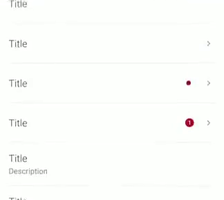

# Lists

<p align="center">
   
   
</p>

Implemented as a custom view, `ListRowView` can be used inside any layout like a regular view, including recyclable lists. It supports both **attribute configuration** and **databinding for all properties**.

```xml
<declare-styleable name="ListRowView">
        <attr name="listRowHeadlineLayout" format="integer">
            <enum name="none" value="-1" />
        </attr>
        <attr name="listRowHeadlineVisible" format="boolean" />
        <attr name="listRowTitle" format="string" />
        <attr name="listRowSubtitle" format="string" />
        <attr name="listRowDescription" format="string" />
        <attr name="listRowAssetDrawable" format="reference" />
        <attr name="listRowIsBoxed" format="boolean" />
        <attr name="listRowHasSmallAsset" format="boolean" />
        <attr name="listRowActionLayout" format="integer">
            <enum name="none" value="-1" />
        </attr>
        <attr name="listRowBadgeCount" format="integer">
            <enum name="gone" value="-1" />
        </attr>
        <attr name="onClick" format="string" />
    </declare-styleable>
```

`ListLayout` class provides extension functions to configure recycler views where the rows can be used, with the 2 available layouts:
* Full Width Layout
* Boxed Layout

Also `app:listLayout` attribute allows configuring recycler views with both styles by taking either:
* com.telefonica.mistica.list.layout.ListLayout.BOXED
* com.telefonica.mistica.list.layout.ListLayout.FULL_WIDTH
