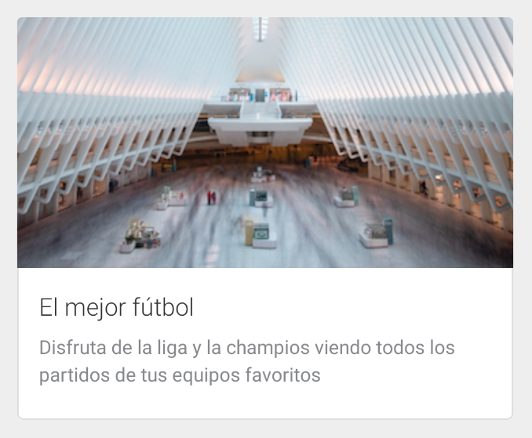

# Media Cards

Media cards consist of an image and some data:

<p align="center">
    
    
    
</p>

To use it, use `com.telefonica.mistica.mediacard.MediaCardView`

Minimum required content for media cards are an image/gif/video and a description. The rest of the elements are optional and can be easily 
configured through the public api or via xml `attr`: 

```xml
    <declare-styleable name="MediaCardView">
        <attr name="mediaCardTag" format="string" />
        <attr name="mediaCardTitle" format="string" />
        <attr name="mediaCardSubtitle" format="string" />
        <attr name="mediaCardDescription" format="string" />
        <attr name="mediaCardPrimaryButtonText" format="string" />
        <attr name="mediaCardLinkButtonText" format="string" />
        <attr name="mediaCardImage" format="reference" />
        <attr name="mediaCardPrimaryButtonOnClick" format="string" />
        <attr name="mediaCardLinkButtonOnClick" format="string" />
        <attr name="mediaCardOnClick" format="string" />
    </declare-styleable>
```