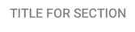

## Section Titles

   

Implemented as a custom view, [`com.telefonica.mistica.section.SectionTitleView`](https://github.com/Telefonica/mistica-android/blob/master/library/src/main/java/com/telefonica/mistica/section/SectionTitleView.kt) can be used inside any layout like a regular view. It would be usually placed above lists.

It has two attributes: `sectionTitle` and `sectionLink`.

`sectionLink` is optional and allows for a listener to be registered that will be invoked when the link is tapped.
