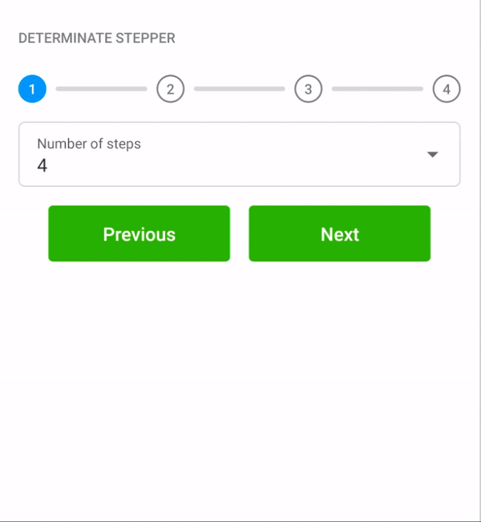

## Steppers

There are two types of steppers:

### Indeterminate

   

Use `com.telefonica.mistica.stepper.IndeterminateStepperView` inside any layout. The progress of this stepper has a range of steps from 0 to 100.
The progress can be set via xml or programmatically through its `setProgress` method: if the value passed is lower than 0 then 0 will be set;
on the other hand, if a value greater than 100 is passed then 100 will be set.

### Determined

   

Use `com.telefonica.mistica.stepper.DeterminateStepperView` inside any layout.

The number of steps and the current step can be set using `maxSteps` and `step` xml attributes or `setMaxSteps` and `setStep` methods respectively.
If the number of steps is not indicated no view will be drawn.

Determinate steppers has a maximum number of visible steps, if the number of steps is more that five,
then the stepper will be displayed as an indeterminate one but keeping the range from 0 to the specific number of steps.
