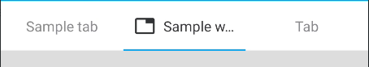

# Tabs

   

Use `com.telefonica.mistica.tabs.TabLayout` instead of the TabLayout from Material components.
The implementation is based on styles overriding, so the API is the same that the component from Material components.
