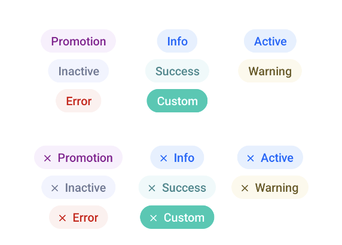

# Tags

<p align="center">
   
</p>

Implemented as a custom view, `com.telefonica.mistica.tag.TagView` can be used like a regular `TextView`, allowing same kind of configuration.

## How to use

```xml
	<com.telefonica.mistica.tag.TagView
			android:layout_width="wrap_content"
			android:layout_height="wrap_content"
			android:text="Active"
			app:tagStyle="active"
			app:tagIcon="@drawable/icon"
			/>
```

```xml
	<declare-styleable name="TagView">
		<attr name="tagIcon" format="reference" />
		<attr name="tagStyle" />
	</declare-styleable>
	<attr name="tagStyle" format="enum">
		<enum name="promo" value="0" />
		<enum name="active" value="1" />
		<enum name="inactive" value="2" />
		<enum name="success" value="3" />
		<enum name="warning" value="4" />
		<enum name="error" value="5" />
		<enum name="inverse" value="6" />
	</attr>
```
