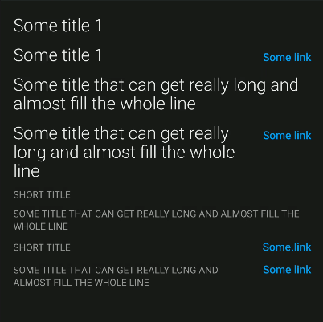

## Titles

   

   

Implemented as a custom view, [`com.telefonica.mistica.title.TitleView`](https://github.com/Telefonica/mistica-android/blob/main/library/src/main/java/com/telefonica/mistica/title/TitleView.kt) can be used inside any layout like a regular 
view. It would be usually placed above lists.

It has these attributes:
- `title`: to set the text of the title
- `titleStyle`: to configure the appearance of the title text. Values supported: `title1`, `title2`.
- `link`: to set the label of an optional link
- `linkOnClick`: listener that will be invoked when link is clicked
- `linkWithChevron`: to show a chevron icon at the end of the link
